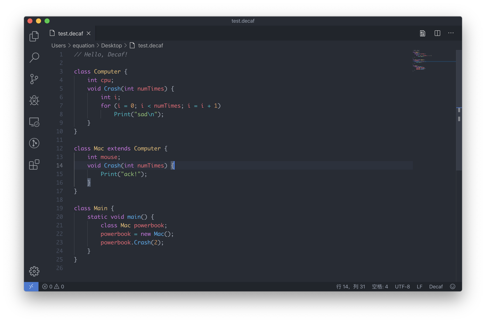

# Decaf language syntax highlighting for Visual Studio Code

#### [Repository](https://github.com/equation314/decaf-vscode) | [decaf-lang](https://github.com/decaf-lang/decaf)

</img>

[Decaf](https://github.com/decaf-lang/decaf) is a Java-like, but much smaller programming language mainly for educational purpose. We now have at least three different implementations of the compiler in Java, Scala and Rust. Since the standard language has quite a limited set of language features, students are welcome to add their own new features.

## Features

* Syntax highlighting
* Autoclosing brackets/quotes

